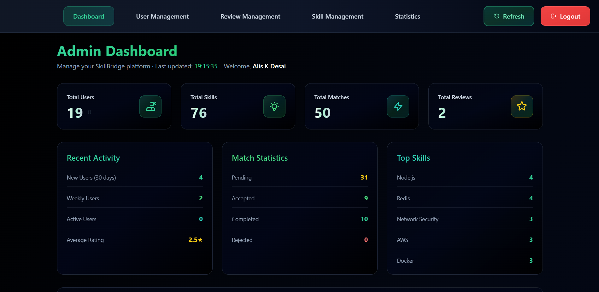
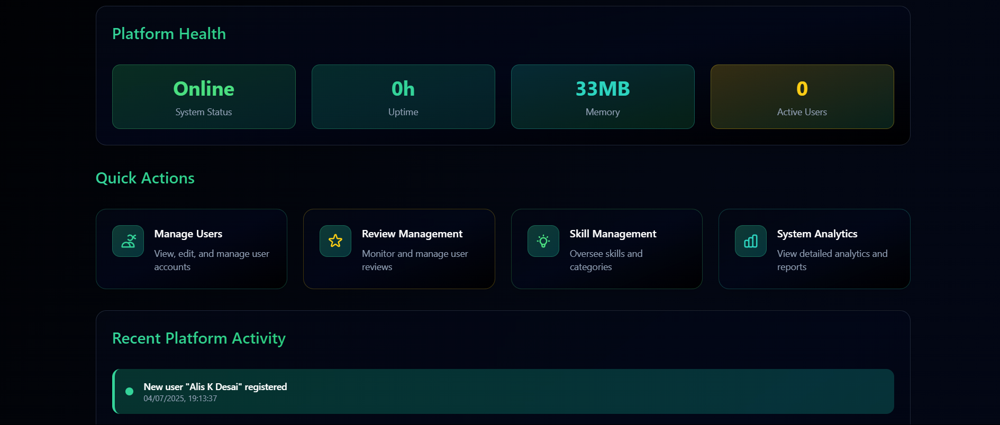
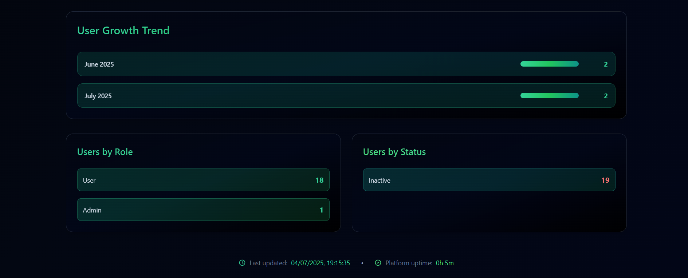
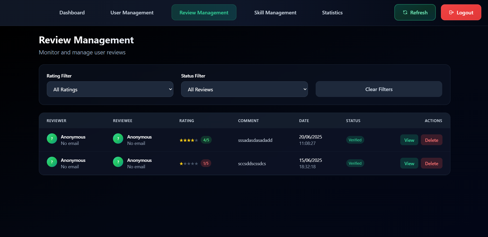
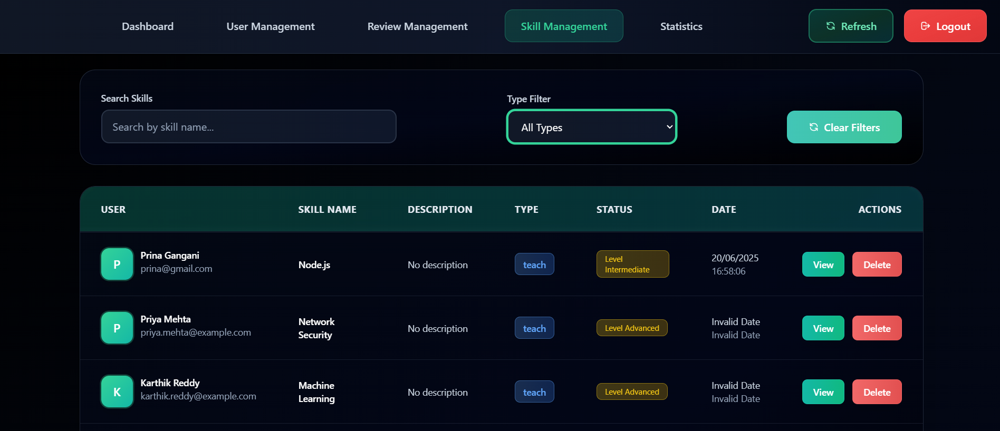
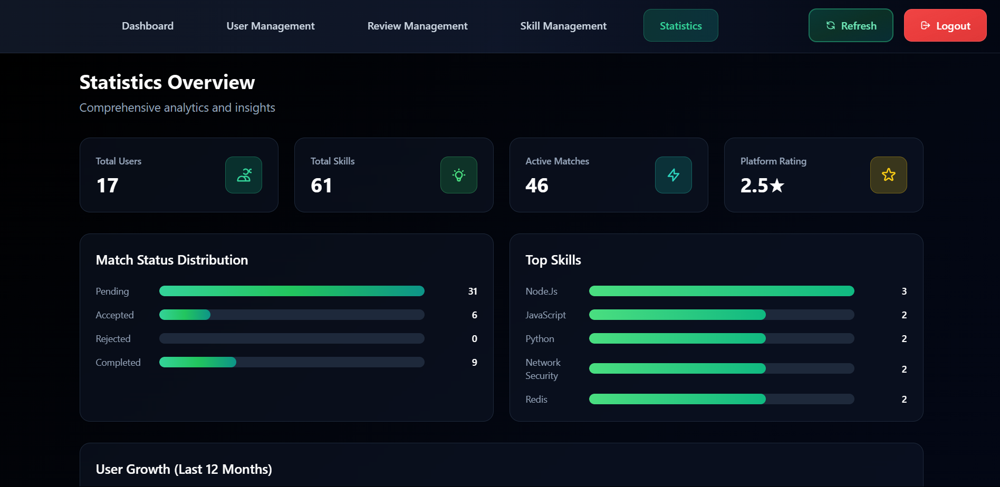
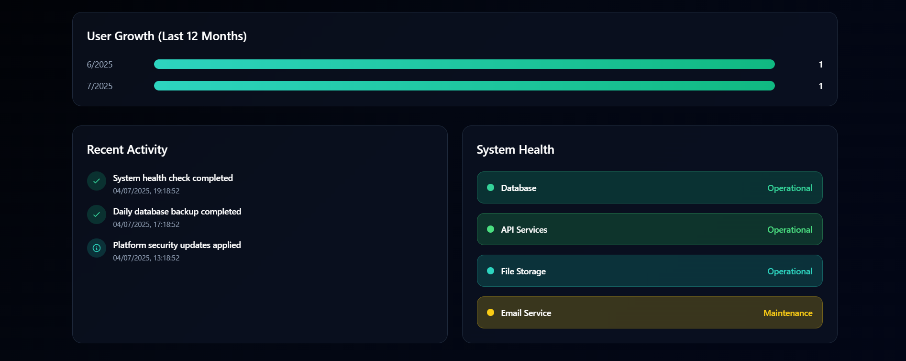
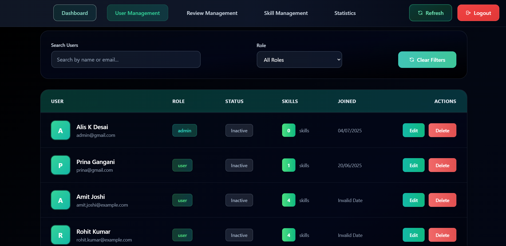

# SkillBridge 🌉
A peer-to-peer skill exchange platform built with MERN stack featuring AI-powered smart matching.

## 📚 Table of Contents
- [Features](#-features)
- [Web-App Images](#-web-app-images)
- [Tech Stack](#-tech-stack)
- [Project Structure](#-project-structure)
- [Quick Start](#-quick-start)
- [API Endpoints](#-api-endpoints)
- [AI Matching](#-ai-smart-matching)
- [Socket Events](#-socket-events)
- [Authentication Flow](#-authentication-flow)
- [UI Components](#-ui-components)
- [Responsive Design](#-responsive-design)
- [State Management](#-state-management)
- [Environment Variables](#-environment-variables)
- [Security](#-security)
- [Development](#-development)
- [Contributing](#-contributing)

## 🚀 Features

- **AI-Powered Matching**: Smart algorithm matches users based on complementary skills
- **Real-time Chat**: Socket.io messaging with typing indicators 
- **Skill Management**: Add/manage teaching and learning skills
- **Rating System**: Post-session reviews and ratings
- **Admin Panel**: User management and content moderation

## 📸 Web-App Images

### 🏠 Landing Page Experience
<div align="center">
  
  <p><em>Hero section with platform overview</em></p>
</div>

<div align="center">
  
  <p><em>AI-powered matching features</em></p>
</div>

<div align="center">
  
  <p><em>Platform user journey guide</em></p>
</div>

<div align="center">
  
  <p><em>Testimonials and registration</em></p>
</div>

### 🔐 Authentication Pages
<div align="center">
  
  <p><em>User registration form</em></p>
</div>

<div align="center">
  
  <p><em>Secure login interface</em></p>
</div>

### 🎯 Dashboard & Skill Management
<div align="center">
  
  <p><em>Main dashboard overview</em></p>
</div>

<div align="center">
  
  <p><em>Skill addition interface</em></p>
</div>

### 👤 Profile & User Details
<div align="center">
  
  <p><em>User profile view</em></p>
</div>

<div align="center">
  
  <p><em>Detailed user information</em></p>
</div>

### 🤖 AI Smart Matching Algorithm
<div align="center">
  
  <p><em>AI match suggestions</em></p>
</div>

<div align="center">
  
  <p><em>Advanced matching results</em></p>
</div>

### 💬 Real-time Chat System
<div align="center">
  
  <p><em>Interactive messaging system</em></p>
</div>

### 🤝 Match Request Management
<div align="center">
  
  <p><em>Match request tracking</em></p>
</div>

### ⚙️ Admin Panel & Management
<div align="center">
  
  <p><em>Admin Dashboard - Main overview</em></p>
</div>

<div align="center">
  
  <p><em>Admin Dashboard - Analytics view</em></p>
</div>

<div align="center">
  
  <p><em>Admin Dashboard - Control panel</em></p>
</div>

<div align="center">
  
  <p><em>Admin Review Management - Quality control</em></p>
</div>

<div align="center">
  
  <p><em>Admin Skill Management - Category tools</em></p>
</div>

<div align="center">
  
  <p><em>Admin Statistics - Performance metrics</em></p>
</div>

<div align="center">
  
  <p><em>Admin Statistics - Advanced analytics</em></p>
</div>

<div align="center">
  
  <p><em>Admin User Management - User controls</em></p>
</div>

## 🛠️ Tech Stack

**Frontend:**
- React.js + Vite
- Redux Toolkit (state management)
- TailwindCSS (styling)
- Socket.io-client (real-time)

**Backend:**
- Node.js + Express.js
- MongoDB + Mongoose
- Socket.io (WebSocket)
- JWT authentication
- Bcrypt encryption

## 📁 Project Structure

```
skillbridge/
├── client/                 # React frontend
│   ├── src/
│   │   ├── components/     # Reusable components
│   │   ├── pages/          # Page components
│   │   ├── redux/          # Redux store & slices
│   │   └── utils/          # Helper functions
├── server/                 # Node.js backend
│   ├── controllers/        # Business logic
│   ├── models/             # MongoDB schemas
│   ├── routes/             # API endpoints
│   ├── middleware/         # Auth & validation
│   └── utils/              # Smart matching AI
└── screenshots/            # App images for README
```

## 🚀 Quick Start

### Prerequisites
- Node.js 16+
- MongoDB
- npm/yarn

### Backend Setup

```bash
cd server
npm install
```

Create `.env` file:
```env
NODE_ENV=development
PORT=5000
MONGO_URI=mongodb://localhost:27017/skillbridge
JWT_SECRET=your_jwt_secret
JWT_REFRESH_SECRET=your_refresh_secret
```

Start server:
```bash
npm run dev
```

### Frontend Setup

```bash
cd client
npm install
npm run dev
```

## 📡 API Endpoints

**Auth Routes:**
- `POST /api/auth/register` - User registration
- `POST /api/auth/login` - User login
- `POST /api/auth/refresh` - Refresh token

**User Routes:**
- `GET /api/users/profile` - Get user profile
- `PUT /api/users/profile` - Update profile
- `GET /api/users/search` - Search users

**Match Routes:**
- `POST /api/matches/request` - Send match request
- `GET /api/matches/smart` - Get AI smart matches
- `PUT /api/matches/:id/accept` - Accept match

**Chat Routes:**
- `GET /api/chats/:matchId` - Get chat messages
- `POST /api/chats/message` - Send message

## 🤖 AI Smart Matching

The platform uses intelligent algorithms to match users:

- **Skill Similarity**: Compares complementary skills
- **Compatibility Scoring**: Rates match potential (1-100)
- **Learning History**: Considers past successful matches
- **Performance Caching**: AI results cached for optimization

## 🔌 Socket Events

**Chat Events:**
- `join_chat` - Join chat room
- `send_message` - Send message
- `typing` - Typing indicator
- `message_read` - Read receipt

**Notification Events:**
- `match_request` - New match request
- `match_accepted` - Match accepted
- `new_message` - New chat message

## 🔐 Authentication Flow

1. User registers with email verification
2. JWT token issued on login
3. Refresh token for session management
4. Protected routes require valid JWT

## 🎨 UI Components

**Common Components:**
- `Button`, `Input`, `Modal`, `Card`
- `Spinner`, `Toast` notifications

**Feature Components:**
- `SmartMatchCard` - AI match display
- `CompatibilityScore` - Match percentage
- `ChatWindow` - Real-time messaging
- `ReviewForm` - Session feedback

## 📱 Responsive Design

- Mobile-first approach
- TailwindCSS utilities

## 🔄 State Management

Redux Toolkit slices:
- `authSlice` - Authentication state
- `userSlice` - User profile data
- `matchSlice` - Matching system
- `chatSlice` - Chat messages
- `smartMatchSlice` - AI recommendations

## 🧪 Development

**Run in development:**
```bash
# Backend
cd server && npm run dev

# Frontend  
cd client && npm run dev
```

**Build for production:**
```bash
cd client && npm run build
```

## 🚦 Environment Variables

**Server (.env):**
```env
NODE_ENV=production
PORT=5000
MONGO_URI=your_mongodb_uri
JWT_SECRET=your_jwt_secret
JWT_REFRESH_SECRET=your_refresh_secret
EMAIL_HOST=smtp.gmail.com
EMAIL_USER=your_email
EMAIL_PASS=your_password
```

## 📈 Key Features Implementation

**Smart Matching Algorithm:**
- Located in `/server/utils/smartMatching.js`
- Uses skill compatibility matrix
- Caches results in `/server/middleware/aiCache.js`

**Real-time Features:**
- Socket.io integration in `/server/sockets/`
- Frontend context in `/client/src/contexts/SocketContext.js`

**Security:**
- JWT with refresh tokens
- Input validation middleware
- Rate limiting on API endpoints
- Password encryption with bcrypt

## 🤝 Contributing

1. Fork the repository
2. Create feature branch (`git checkout -b feature/new-feature`)
3. Commit changes (`git commit -m 'Add feature'`)
4. Push to branch (`git push origin feature/new-feature`)
5. Open Pull Request

---

<div align="center">
  <h2>🙏 Thank You</h2>
  <p><em>Thank you for using SkillBridge! I hope my platform helps you connect, learn, and grow with amazing people around the world.</em></p>
  <p>Happy Learning! 🌟</p>
</div>
